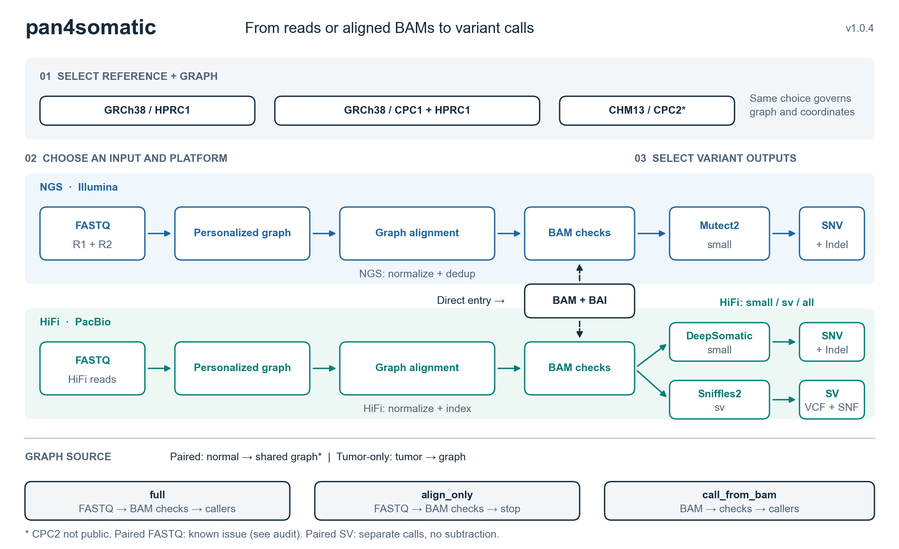

# pan4somatic

Pangenome-assisted variant analysis with Nextflow for **Illumina NGS and PacBio HiFi**. Choose a reference/graph, start from FASTQ or aligned BAM, and select the variant outputs.

**[Download v1.0.4](https://github.com/Shuhua-Group/pan4somatic/releases/tag/v1.0.4)** · **[Start here](MANUAL.md#start-here)** · [Resources](RESOURCES.md) · [HG002 test data](MANUAL.md#11-hg002-test-data-direct-downloads)

## Workflow overview



[SVG](docs/figures/pan4somatic_workflow_v1.0.4.svg) · [PDF](docs/figures/pan4somatic_workflow_v1.0.4.pdf) · [Figure notes](docs/figures/WORKFLOW_FIGURE.md).

## Choose your analysis

### Choose the pangenome reference

The reference/graph choice controls both graph alignment and the coordinates reported in the output VCF. State both flags explicitly for reproducible runs.

| Output coordinates | Pangenome graph | Required selection | Availability |
|---|---|---|---|
| GRCh38 | HPRC1 | `--genome grch38 --graph_version hprc1` | Public |
| GRCh38 | CPC1 + HPRC1 | `--genome grch38 --graph_version cpc1_hprc1` | Public; default GRCh38 graph |
| CHM13 | CPC2 | `--genome chm13 --graph_version cpc2` | Implemented; graph not publicly released |

The two GRCh38 options enable comparisons between pangenome backgrounds in the same coordinate system. See [resources and graph availability](RESOURCES.md) before running CHM13/CPC2.

### Choose the sequencing platform and callers

| Data | SNV / Indel | SV | Caller selection |
|---|---|---|---|
| Illumina NGS | Mutect2 | Not implemented | `--platform ngs --variant_type small` |
| PacBio HiFi | DeepSomatic | Sniffles2 | `--platform tgs --longread_technology pacbio --variant_type small`, `sv` or `all` |

**Entry:** `full` (FASTQ → variants), `align_only` (FASTQ → checked BAM), or `call_from_bam` (aligned BAM → variants). GAM is an intermediate, not a direct input. NGS and HiFi are separate runs.

**Validation status:** paired FASTQ graph routing has been corrected. Twelve Nextflow routing cases pass for NGS/HiFi, all three entry modes and tumor-only/paired analysis. These tests mock the bioinformatics tool bodies; a fresh real-data server acceptance run remains required before public release. See [validation details](docs/AUDIT.md).

## Get started

1. Download **`pan4somatic_v1.0.4.tar.gz` and `pan4somatic_v1.0.4.sha256`** from [Release assets](https://github.com/Shuhua-Group/pan4somatic/releases/tag/v1.0.4). GitHub's automatic “Source code” downloads snapshot this documentation repository; use the attached workflow archive.
2. Verify and extract on Linux:

   ```bash
   sha256sum -c pan4somatic_v1.0.4.sha256
   tar -xzf pan4somatic_v1.0.4.tar.gz
   cd pan4somatic_v1.0.4
   bash tests/static_checks.sh
   ```

3. Prepare the [resources required for your entry](MANUAL.md#4-install-and-configure-resources), then select **one** [run example](MANUAL.md#5-complete-run-examples).

SIF containers and reference assets are not included in the software archive. Download sources and preparation instructions are in [RESOURCES.md](RESOURCES.md).

## Validation and documentation

HG002 subset and same-source paired tests demonstrate engineering execution, not biological somatic accuracy or full-depth WGS performance. Paired Sniffles2 emits independent tumor/normal calls; downstream somatic SV classification is required.

| Need | Read |
|---|---|
| Run commands, parameter choices, outputs and troubleshooting | [User manual](MANUAL.md) |
| Reference/graph/container downloads | [Resources](RESOURCES.md) |
| Original HG002 NGS and HiFi inputs | [Test-data downloads](MANUAL.md#11-hg002-test-data-direct-downloads) |
| Validation provenance and checksums | [Release notes](RELEASE_NOTES.md) |
| Source corrections and validation scope | [Audit](docs/AUDIT.md) |
| Historical validation evidence | [Supplement](SUPPLEMENT.md) |

MIT license. The repository is publicly accessible. Software version: 1.0.4.

## Contact

Correspondence and requests for materials should be addressed to **Prof. Shuhua Xu** ([xushua@fudan.edu.cn](mailto:xushua@fudan.edu.cn)). For technical questions and bug reports, please contact **Dr. Xia Tang** ([tang.xia@fudan.edu.cn](mailto:tang.xia@fudan.edu.cn)).
